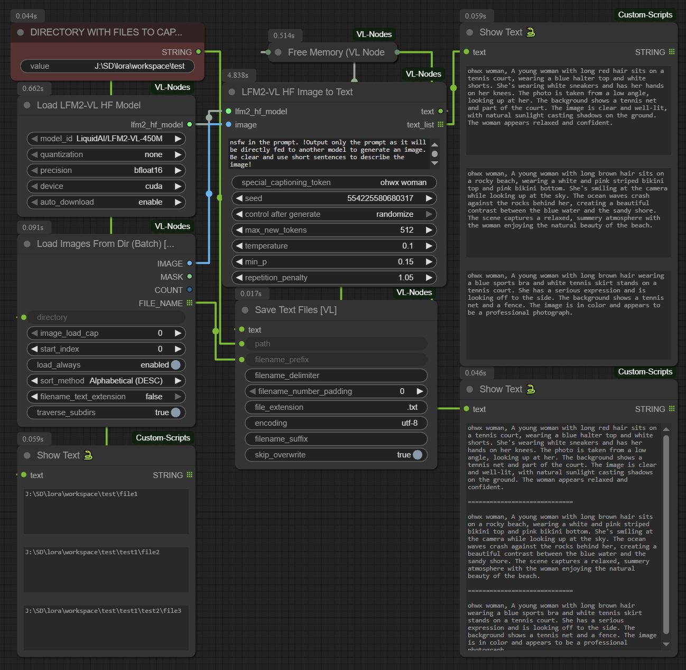
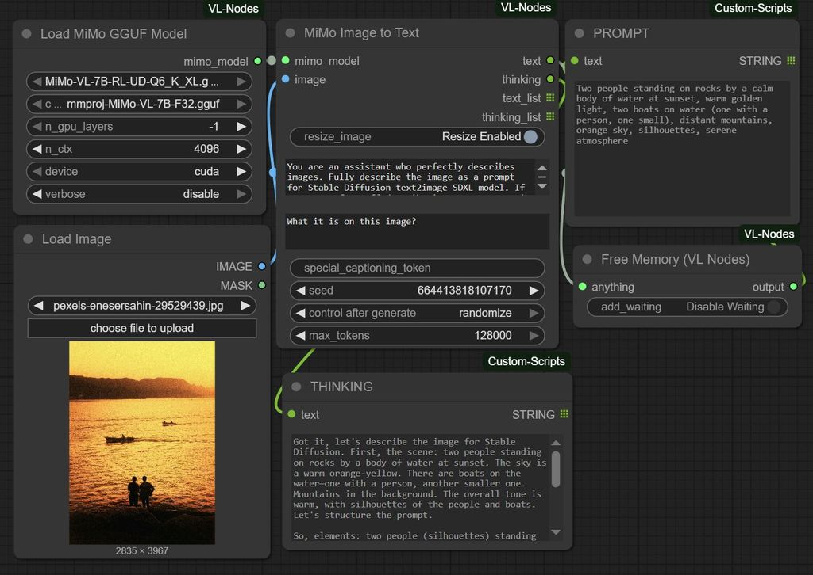
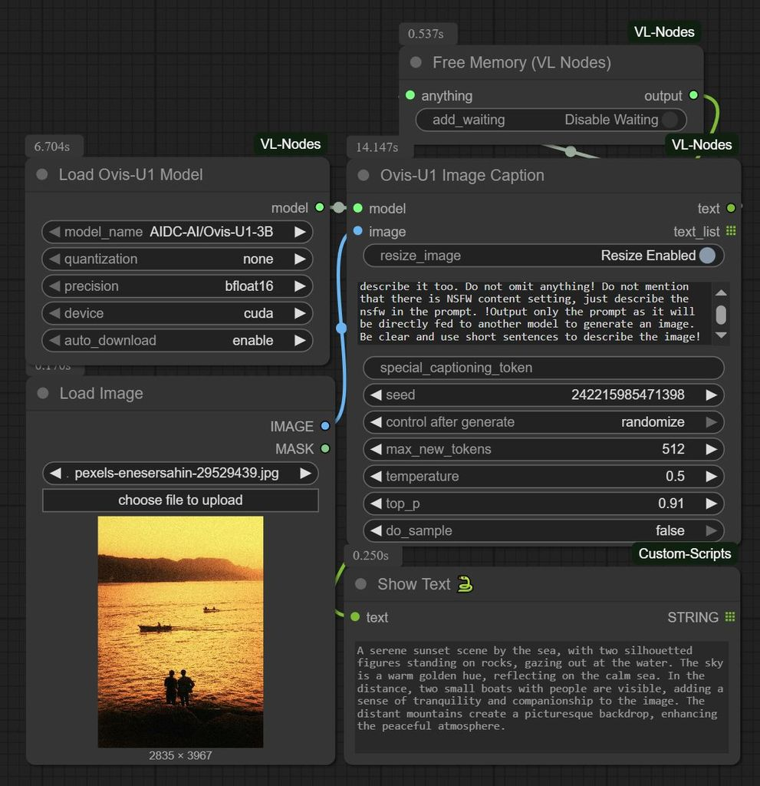

# ComfyUI-VL-Nodes

This repository provides a collection of custom nodes for ComfyUI that integrate various Vision-Language (VL) models. These nodes allow you to perform tasks like image captioning, visual question answering (VQA), and generating detailed image descriptions directly within your ComfyUI workflows. **Strictly image2text workflows**. This is particularly useful for creating rich prompts for text-to-image models. These nodes were for my own usage and experimentation but I decided to share them with the community. Feel free to fork this repo and expand the support for more VL models.


## Batch Image Captioning (version>=0.6)

A key feature of this custom node set is the ability to caption a whole directory of images in one go. By using the `Load Images/FileNames from Dir (Batch)(VL)` or `Load Images/FileNames from Dir (List)(VL)` nodes, you can feed a series of images into any of the supported VL models and generate captions for each one. The workflow is designed to save the generated text files next to the original images, making it easy to manage large datasets for training or analysis.

* Input is a directory with a batch of images
* The output is a batch of single .txt files with the same name as the image with the description in it, saved in the same directory as the images
* You can add a special token as a prefix
* You are going to need to install the `Save Text File` node from [was-node-suite-comfyu](https://github.com/WASasquatch/was-node-suite-comfyuil)
* **All the model nodes were updated to support batch image captioning**

### Nodes


### Example Workflow


### Resulting files


## Features

This project includes nodes for the following models:

* **Xiaomi MiMo-VL GGUF only**: Utilizes GGUF models for efficient image-to-text generation (MiMo-VL-7B-RL-GGUF).
* **LiquidAI LFM2-VL transformers only**: Supports Hugging Face transformer models for image-to-text tasks (LiquidAI/LFM2-VL-450M, LiquidAI/LFM2-VL-1.6B).
* **AIDC-AI Ovis-U1 transformers only**: Provides nodes for the Ovis-U1 model for image captioning (AIDC-AI/Ovis-U1-3B).
* **AIDC-AI Ovis-2.5 transformers only**: Adds support for the Ovis-2.5 model series (AIDC-AI/Ovis2.5-2B, AIDC-AI/Ovis2.5-9B).
  * **WARNING**: AIDC-AI/Ovis2.5-9B is a chunky model (18Gb+). Be aware before starting to download!
* **Kwai-Keye Keye-VL transformers only**: Adds support for the Keye-VL model (Kwai-Keye/Keye-VL-8B-Preview).
  * **WARNING**: Kwai-Keye/Keye-VL-8B-Preview is a chunky model (17Gb+)
* **General Utilities**: Includes a `Free Memory` node to help manage VRAM by unloading all loaded VL models.

## Installation

### Prerequisites

* ComfyUI installed and set up.
* For LFM2-VL models you need **transformers>=4.54.0**
* For GGUF models (like MiMo-VL), **llama-cpp-python with CUDA support** is highly recommended for performance. Follow the compilation instructions below.
* For Ovis-U1 and Keye-VL you need **flash-attn**. Prebuilt wheels: [HERE](https://github.com/mjun0812/flash-attention-prebuild-wheels/releases)

### Compiling `llama-cpp-python` with CUDA (Recommended for GGUF)

For GPU acceleration with GGUF models, `llama-cpp-python` must be compiled with CUDA support.

*   **Pre-built Wheels (Easiest Method)**: You can often find pre-compiled wheels for Windows and Linux here: [https://github.com/JamePeng/llama-cpp-python/releases](https://github.com/JamePeng/llama-cpp-python/releases)
*   **Manual Compilation (Windows)**:
    1.  **Install Build Tools**: Install Visual Studio (e.g., 2022) with the "Desktop development with C++" workload and the NVIDIA CUDA Toolkit.
    2.  **Open Command Prompt**: Open the "x64 Native Tools Command Prompt for VS 2022".
    3.  **Activate ComfyUI's venv**.
    4.  **Install build dependencies**: `pip install cmake ninja`
    5.  **Clone and Build**:
        ```bash
        git clone --recurse-submodules https://github.com/abetlen/llama-cpp-python.git
        cd llama-cpp-python
        set FORCE_CMAKE=1
        set CMAKE_ARGS=-DGGML_CUDA=on -G Ninja
        set GGML_CUDA=1
        set LLAMA_BUILD_EXAMPLES=OFF
        set LLAMA_BUILD_TESTS=OFF
        set CMAKE_BUILD_PARALLEL_LEVEL=8
        pip install --force-reinstall --no-cache-dir .
        ```
    6.  **Restart ComfyUI**.

You might not need CMAKE_BUILD_PARALLEL_LEVEL if you used -G Ninja.

### Node Installation

1.  **Clone this repository** into your `ComfyUI/custom_nodes/` directory:
    ```bash
    cd ComfyUI/custom_nodes/
    git clone https://github.com/dimtoneff/ComfyUI-VL-Nodes.git
    ```
2.  **Install Python Dependencies**:
    ```bash
    cd ComfyUI-VL-Nodes
    pip install -r requirements.txt
    ```
3.  **Restart ComfyUI**.

## Model Downloads

Each model type has its own requirements for model files.

### MiMo-VL (GGUF)

* **Models**: You need the main GGUF model (e.g., `mimo-vl-7b-q4_k_m.gguf`) and the corresponding CLIP vision model (e.g., `mmproj-model-f16.gguf`). **IMPORTANT**: Rename the mmproj file to `mmproj-mimo`-etc-etc-etc.gguf. A good source is [unsloth/MiMo-VL-7B-RL-GGUF](https://huggingface.co/unsloth/MiMo-VL-7B-RL-GGUF).
*   **Location**: Place both files in the same directory. You can use `ComfyUI/models/unet` for the main model and `ComfyUI/models/clip` for the vision model, or use a shared directory.
*   **Example `extra_model_paths.yaml`**:
    ```yaml
    llm:
        base_path: X:\LLM
        unet: unsloth/MiMo-VL-7B-RL-GGUF
        clip: unsloth/MiMo-VL-7B-RL-GGUF
    ```

### LFM2-VL (Hugging Face)

*   **Models**: These are downloaded automatically from the Hugging Face Hub.
*   **Location**: They will be saved to `ComfyUI/models/unet/LFM2-VL-HF`.

### Ovis-U1 (Hugging Face)

*   **Models**: These can be downloaded automatically from the Hugging Face Hub.
*   **Location**: They will be saved to a subdirectory inside `ComfyUI/models/unet`.

### Ovis-2.5 (Hugging Face)

*   **Models**: These can be downloaded automatically from the Hugging Face Hub.
*   **Location**: They will be saved to a subdirectory inside `ComfyUI/models/unet`.

### Keye-VL (Hugging Face)

*   **Models**: These can be downloaded automatically from the Hugging Face Hub.
*   **Location**: They will be saved to a subdirectory inside `ComfyUI/models/unet`.


## Usage

Once installed, you will find the nodes under the `MiMo`, `LFM2-VL`, `Ovis2.5`, `Ovis-U1` and `Keye-VL` categories. Or double left click on empty space and search for the model name to see the nodes.

### MiMo Nodes

*   **`Load MiMo GGUF Model`**: Loads the MiMo GGUF model and its vision projector.
*   **`MiMo Image to Text`**: Generates a detailed description of an image based on a prompt.

### LFM2-VL Nodes

*   **`Load LFM2-VL HF Model`**: Loads LFM2-VL transformer models from Hugging Face.
*   **`LFM2-VL HF Image to Text`**: Generates text from an image using the loaded HF model.

### Ovis-U1 Nodes

*   **`Load Ovis-U1 Model`**: Loads Ovis-U1 models from Hugging Face.
*   **`Ovis-U1 Image Caption`**: Generates a caption for an image.

### Ovis-2.5 Nodes

*   **`Load Ovis-2.5 Model`**: Loads Ovis-2.5 models from Hugging Face.
*   **`Ovis-2.5 Image to Text`**: Generates text from an image using the loaded model, with optional "thinking" output.

### Keye-VL Nodes

*   **`Load Keye-VL Model`**: Loads Keye-VL models from Hugging Face.
*   **`Keye-VL Image to Text`**: Generates text from an image using the loaded model. It supports multiple thinking modes:
    *   **Non-Thinking Mode**: Appends `/no_think` to the prompt for a direct response.
    *   **Auto-Thinking Mode**: Default behavior, the model decides whether to "think".
    *   **Thinking Mode**: Appends `/think` to the prompt to encourage a more detailed, reasoned response.
*   **Image Resolution**: You can control the image resolution for a potential performance boost by setting `min_pixels` and `max_pixels`, or `resized_height` and `resized_width`.

### General Nodes

*   **`Load Images/FileNames from Dir (Batch)(VL)`**: Loads a batch of images from a specified directory and outputs them as a single batch tensor. It also provides the file names for each image, allowing for automated saving of generated captions.
*   **`Load Images/FileNames from Dir (List)(VL)`**: Similar to the batch version, but outputs images and file names as lists. This is useful for workflows that require iterating through images individually.
*   **`Free Memory (VL Nodes)`** (Category: `VL-Nodes/Memory`): Unloads all loaded VL models to free up VRAM.

## Example Workflow

1.  Load a model using one of the `Load...` nodes (e.g., `Load MiMo GGUF Model`).
2.  Load an image using a standard ComfyUI `Load Image` node.
3.  Connect the model and image to the corresponding `Image to Text` or `Image Caption` node.
4.  The text output can then be fed into a `CLIP Text Encode` node for your text-to-image pipeline.

## Special Thanks and Links

[Visual icons created by Freepik - Flaticon](https://www.flaticon.com/free-icons/visual)

## Other examples




